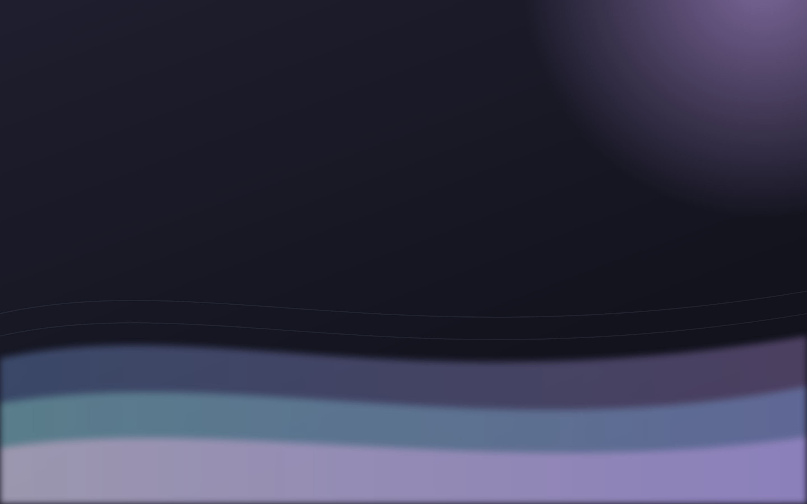

# 🪟 Hyprland Dotfiles — Catppuccin Mocha

Cấu hình Hyprland cá nhân (Ubuntu 26.04, GPU AMD) — tông màu **Catppuccin Mocha**, thanh bar nổi, trung tâm điều khiển, gõ tiếng Việt tự bật, quay màn, và nhiều tiện ích.



## ✨ Tính năng

- **Catppuccin Mocha** đồng bộ: Hyprland (viền gradient, blur, shadow, animation) + Waybar + Wofi + Kitty + SwayNC + Cava.
- **Thanh bar nổi (Waybar)** — icon Nerd Font (Material Design), workspace có biểu tượng, CPU/RAM/độ sáng/âm lượng/wifi/pin, nút thông báo.
- **Trung tâm điều khiển (SwayNC)** — Wifi/Bluetooth/âm lượng/độ sáng/DND + lịch sử thông báo.
- **Gõ tiếng Việt** (ibus + Unikey) tự bật khi đăng nhập, phím cứu hộ.
- **Quay màn hình** (wf-recorder), **lịch sử clipboard** (cliphist, kiểu Win+V), **chụp màn** (grimshot + swappy).
- **Cava** (cột nhạc) + **Fastfetch** (màn chào terminal).
- Hình nền + icon app tự thiết kế (nguồn SVG trong `assets/`).

## ⌨️ Phím tắt chính (MOD = SUPER / phím Windows)

| Phím | Tác dụng |
|------|----------|
| `MOD + Enter` | Terminal (kitty) |
| `MOD + D` | Menu ứng dụng (wofi) |
| `MOD + E` | Trình quản lý file |
| `MOD + W` | Đổi hình nền (azote) |
| `MOD + N` | Trung tâm điều khiển (swaync) |
| `MOD + A` | Cava (cột nhạc) |
| `MOD + V` | Lịch sử clipboard |
| `MOD + Space` | Đổi bộ gõ Việt ⇄ Anh |
| `MOD + Shift + Space` | Cứu hộ bộ gõ (restart ibus) |
| `MOD + Shift + S` | Chụp vùng → clipboard (giống Windows) |
| `MOD + R` / `MOD + Shift + R` | Quay màn / quay vùng chọn |
| `MOD + Escape` | Menu nguồn (wlogout) |
| `MOD + Q` | Đóng cửa sổ · `MOD + F` toàn màn · `MOD + 1..9` workspace |

## 📦 Gói cần cài (Ubuntu)

```bash
sudo apt install hyprland waybar wofi kitty hyprpaper hyprlock hypridle \
  hyprpolkitagent xdg-desktop-portal-hyprland grim slurp wl-clipboard \
  brightnessctl playerctl network-manager-gnome pavucontrol cliphist \
  swappy grimshot wf-recorder blueman azote swaybg \
  sway-notification-center cava fastfetch \
  fonts-font-awesome fonts-jetbrains-mono ibus ibus-unikey
```
Thêm **JetBrainsMono Nerd Font** (icon thanh bar): tải từ https://github.com/ryanoasis/nerd-fonts → giải nén vào `~/.local/share/fonts/` → `fc-cache -f`.

## 🚀 Cài đặt

```bash
git clone https://github.com/vanhiepkim0-gif/hyprland1.git
cd hyprland1
./install.sh        # sao chép .config/* vào ~/.config (tự sao lưu bản cũ)
```
Rồi đăng xuất, ở màn hình đăng nhập chọn **Hyprland**.

## 📝 Ghi chú
- Màn laptop 2880×1800 để `scale = 1.6` (sửa trong `hypr/hyprland.conf` dòng `monitor`).
- Icon dùng **Material Design** của Nerd Font (bản v3 đã dời Font Awesome cũ).
- Hình nền mặc định: `assets/catppuccin-waves.png` (đổi path trong `hyprland.conf`).

---
*Cấu hình tạo với sự hỗ trợ của Claude Code.* 🤖
